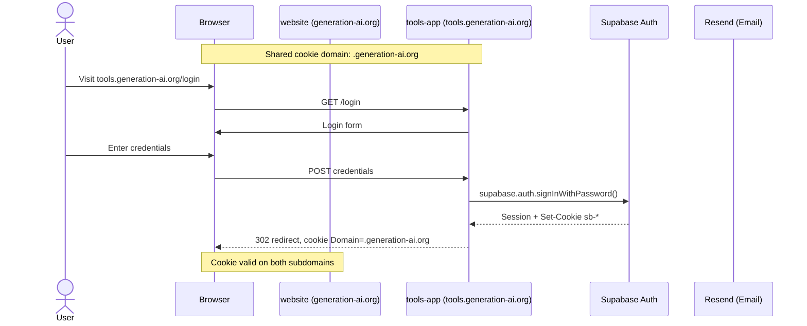
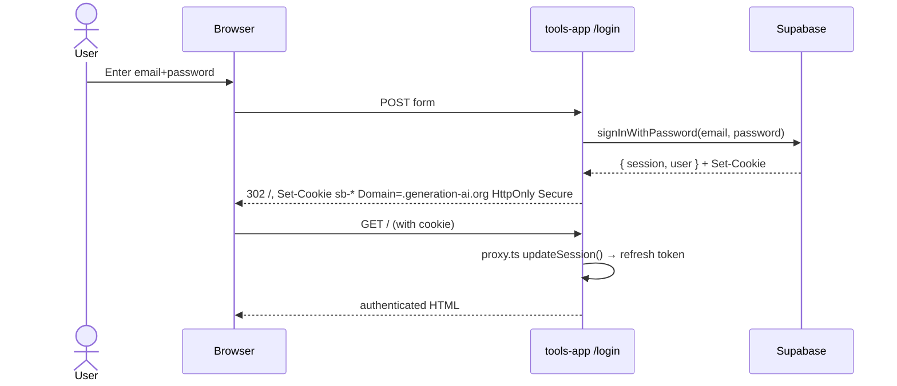
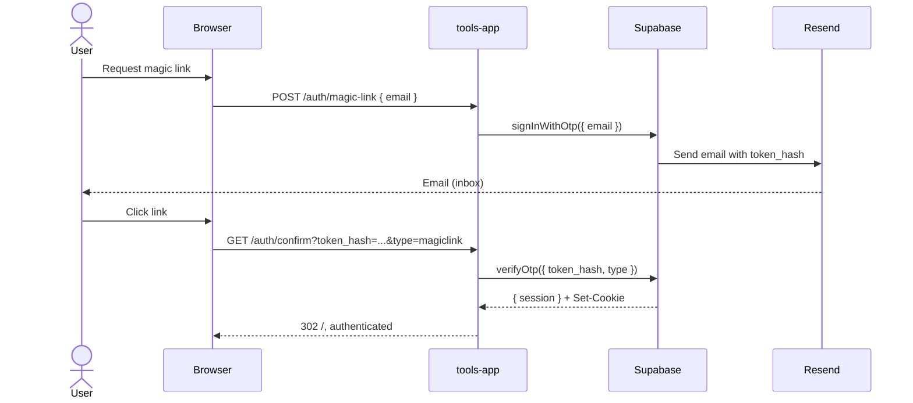
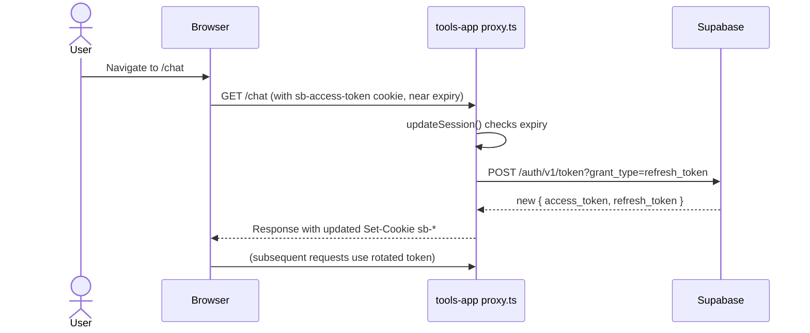
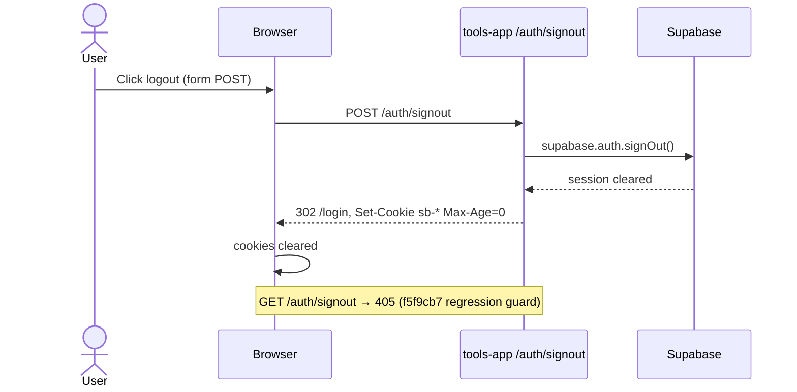
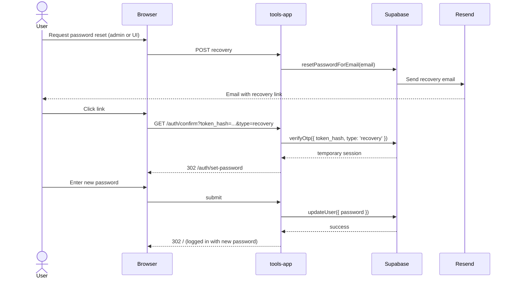
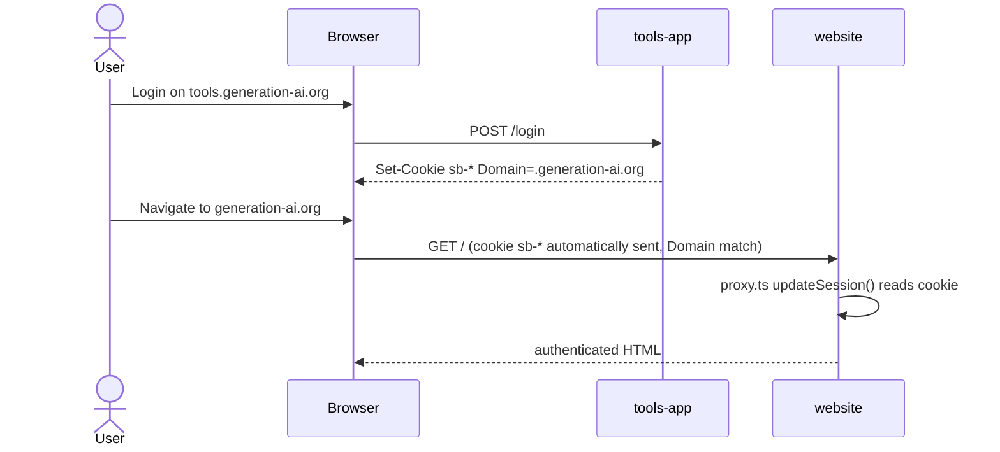

<objective>
Wave 3: AUTH-FLOW.md konsolidieren und finalisieren. Mermaid-Diagramme pro Pfad + Overview. ARCHITECTURE.md-Link ergänzen.

Purpose: D-15/D-16 — die Phase produziert eine lesbare Single-Source-of-Truth für Auth, die auch in 6 Monaten noch verständlich ist. Alle Draft-Sections aus Plan 02/03/04/05 werden in ein kohärentes Dokument zusammengeführt.
Output: Final `docs/AUTH-FLOW.md` (DRAFT-Marker entfernt) + Cross-Link in ARCHITECTURE.md.
</objective>

<execution_context>
@$HOME/.claude/get-shit-done/workflows/execute-plan.md
@$HOME/.claude/get-shit-done/templates/summary.md
</execution_context>

<context>
@.planning/phases/13-auth-flow-audit-csp-reaktivierung/13-CONTEXT.md
@.planning/phases/13-auth-flow-audit-csp-reaktivierung/13-02-SUMMARY.md
@.planning/phases/13-auth-flow-audit-csp-reaktivierung/13-03-SUMMARY.md
@.planning/phases/13-auth-flow-audit-csp-reaktivierung/13-04-SUMMARY.md
@.planning/phases/13-auth-flow-audit-csp-reaktivierung/13-05-SUMMARY.md
@docs/AUTH-FLOW.md
@docs/ARCHITECTURE.md
</context>

<tasks>

<task type="auto" tdd="false">
  <name>Task 1: AUTH-FLOW.md Final — Overview-Diagramm + 6 Pfad-Diagramme + Findings finalisieren</name>
  <files>docs/AUTH-FLOW.md</files>
  <read_first>
    - docs/AUTH-FLOW.md (current Draft-Stand nach Plan 02/03/04/05)
    - .planning/phases/13-auth-flow-audit-csp-reaktivierung/13-02-SUMMARY.md (Findings)
    - .planning/phases/13-auth-flow-audit-csp-reaktivierung/13-03-SUMMARY.md (Consolidation)
    - .planning/phases/13-auth-flow-audit-csp-reaktivierung/13-04-SUMMARY.md (website CSP)
    - .planning/phases/13-auth-flow-audit-csp-reaktivierung/13-05-SUMMARY.md (tools-app CSP)
    - packages/auth/src/middleware.ts (updateSession Pattern für Refresh-Diagramm)
    - apps/tools-app/app/auth/confirm/route.ts (Recovery-Callback für Pfad 5 Diagramm)
  </read_first>
  <action>
Restrukturiere `docs/AUTH-FLOW.md` zur finalen Version. Existierende Sections von Plan 02/03/04/05 bleiben inhaltlich erhalten, werden aber einsortiert in die finale Struktur:

```markdown
# Auth Flow — Generation AI

Single-source-of-truth for all authentication paths across generation-ai.org + tools.generation-ai.org.

Last audit: Phase 13 (YYYY-MM-DD)
Canonical implementation: `@genai/auth` (Phase 12, canonical @supabase/ssr pattern)

## Overview



## The 6 Auth Paths

### Path 1: Login via Email+Password

**Status:** {verified-ok | fixed | backlog} — Plan 13-02



Cookie attributes (verified in E2E Plan 13-02):
- Name prefix: `sb-`
- Domain: `.generation-ai.org` (cross-subdomain)
- HttpOnly, Secure, SameSite=Lax

Verification: `cd packages/e2e-tools && BASE_URL=https://tools.generation-ai.org pnpm exec playwright test --grep "Path 1"`

### Path 2: Magic Link

**Status:** {...} — Plan 13-02



Test strategy: E2E verwendet `admin.auth.admin.generateLink({ type: 'magiclink' })` um ohne echte Inbox den action_link zu bekommen. Siehe `packages/e2e-tools/helpers/supabase-admin.ts`.

### Path 3: Session-Refresh (Manual-Only)

**Status:** {verified-ok manual | ...} — Plan 13-02 (manual-only)



Why manual: Token-Expiry-Simulation in kurzen E2E-Tests nicht zuverlässig. Manuell via Playwright-MCP geprüft (Screenshots in `docs/auth-flow-screenshots/path-3-refresh.*`).

### Path 4: Signout (POST-only Regression Guard)

**Status:** verified-ok — Plan 13-02



**Regression Anchor (f5f9cb7):** GET /auth/signout → 405. E2E test: `test("GET /auth/signout returns 405")` in `auth.spec.ts`. Never reintroduce a GET handler here — prefetch of `<Link>` components triggers GET and would destroy sessions automatically.

### Path 5: Password-Reset End-to-End

**Status:** {verified-ok | fixed | backlog} — Plan 13-02



**Known limitation (Backlog):** No "Forgot password?" link on login page yet — reset only via Supabase admin trigger currently.

### Path 6: Cross-Domain Session

**Status:** verified-ok — Plan 13-02



Verified: cookie `Domain=.generation-ai.org` (leading dot) makes it valid on BOTH `generation-ai.org` and `tools.generation-ai.org`. `NEXT_PUBLIC_COOKIE_DOMAIN` env var (Phase 12).

## Findings (Final)

| # | Path | Finding | Severity | Status | Resolution |
|---|------|---------|----------|--------|------------|
| {from Plan 02 + 03 final table} |

## Consolidation Audit (Phase 13 Plan 03)

{unchanged from Plan 03 output — grep evidence + naming quirk note}

## CSP Rollout

### website (Plan 13-04)
{unchanged from Plan 04 output — headers, securityheaders rating, violations}

### tools-app (Plan 13-05)
{unchanged from Plan 05 output — headers, feature-verification, securityheaders rating}

## Signup (Disabled by Design)

Per decision D-17 (Phase 13 CONTEXT): `/api/auth/signup` returns 503 with placeholder message. Intentional — reactivation requires explicit decision from Luca.

File: `apps/website/app/api/auth/signup/route.ts`
Rationale: See STATE.md ("Signup ist auf 503 disabled — nicht wieder aktivieren ohne expliziten Auftrag").
Reactivation path: Restore from git history, add signup tests in `packages/e2e-tools`.

## Test Suite

E2E test file: `packages/e2e-tools/tests/auth.spec.ts`

| Describe Block | Status | Notes |
|----------------|--------|-------|
| Path 1: Password Login | active | Login-cookie, session-reload |
| Path 2: Magic Link | active | admin generateLink |
| Path 3: Session Refresh | skip (manual-only) | See above |
| Path 4: Signout POST-only | active | GET → 405 regression guard |
| Path 5: Password Reset | {active/skip} | generateRecoveryLink → set-password |
| Path 6: Cross-Domain Cookie | active | Domain=.generation-ai.org |
| CSP Baseline | active | No violations on /login |
| General | active | Smoke |

Run: `cd packages/e2e-tools && BASE_URL=https://tools.generation-ai.org pnpm exec playwright test auth.spec.ts`

## References

- Phase 12 SUMMARY: `.planning/phases/12-auth-rewrite/` (canonical @genai/auth consolidation)
- Phase 13 plans: `.planning/phases/13-auth-flow-audit-csp-reaktivierung/*-PLAN.md`
- `packages/auth/` — canonical implementation
- STATE.md — current deployment + session-drop-bug (f5f9cb7) history
```

**Wichtig:** DRAFT-Marker entfernen (Top des Dokuments). Findings-Tabelle finalisieren mit echten Daten aus Plan 02 Summary. Mermaid-Diagramme validieren (render-check via `mermaid-cli` wenn verfügbar, sonst visuell prüfen).
  </action>
  <verify>
    <automated>grep -c "\`\`\`mermaid" docs/AUTH-FLOW.md | awk '{exit ($1 &lt; 7)}' &amp;&amp; grep -q "## Overview" docs/AUTH-FLOW.md &amp;&amp; grep -q "## The 6 Auth Paths" docs/AUTH-FLOW.md &amp;&amp; grep -q "f5f9cb7" docs/AUTH-FLOW.md &amp;&amp; grep -q "Signup (Disabled by Design)" docs/AUTH-FLOW.md &amp;&amp; ! grep -q "DRAFT" docs/AUTH-FLOW.md</automated>
  </verify>
  <acceptance_criteria>
    - `grep -c "^\`\`\`mermaid" docs/AUTH-FLOW.md` → mindestens 7 (1 Overview + 6 Pfade)
    - `grep -c "### Path [1-6]" docs/AUTH-FLOW.md` → 6
    - `grep -q "## Findings" docs/AUTH-FLOW.md` → match (mit konkreten Zeilen, nicht leer)
    - `grep -q "## Consolidation Audit" docs/AUTH-FLOW.md` → match
    - `grep -q "## CSP Rollout" docs/AUTH-FLOW.md` → match
    - `grep -q "### website" docs/AUTH-FLOW.md` und `grep -q "### tools-app" docs/AUTH-FLOW.md` unter CSP Rollout
    - `grep -q "f5f9cb7" docs/AUTH-FLOW.md` → match (Signout regression reference)
    - `grep -q "Signup (Disabled by Design)" docs/AUTH-FLOW.md`
    - `grep -q "\.generation-ai\.org" docs/AUTH-FLOW.md` → match (cookie domain erwähnt)
    - DRAFT-Header ist entfernt (`! grep -q "^Status: DRAFT" docs/AUTH-FLOW.md`)
    - Dokument ≥ 250 Zeilen (`wc -l docs/AUTH-FLOW.md` ≥ 250)
  </acceptance_criteria>
  <done>AUTH-FLOW.md ist vollständig, 7 Mermaid-Diagramme, alle Findings resolved, CSP-Rollouts dokumentiert.</done>
</task>

<task type="auto" tdd="false">
  <name>Task 2: ARCHITECTURE.md Cross-Link + BACKLOG-Cleanup</name>
  <files>docs/ARCHITECTURE.md</files>
  <read_first>
    - docs/ARCHITECTURE.md (existing Auth-Abschnitt suchen)
    - .planning/BACKLOG.md (prüfen ob neue Items aus Plan 02/03 korrekt eingetragen sind)
  </read_first>
  <action>
1. `docs/ARCHITECTURE.md` öffnen. Nach Abschnitt suchen der Auth behandelt (z.B. `## Auth`, `## Authentication`, `### Auth Stack`, `## Datenfluss` o.Ä.). Dort Link ergänzen:

```markdown
> Detaillierte Auth-Flows, Mermaid-Sequenzdiagramme aller 6 Pfade und Findings aus dem Phase-13-Audit: siehe [docs/AUTH-FLOW.md](./AUTH-FLOW.md).
```

Falls keine Auth-Sektion existiert: neue Mini-Sektion `## Authentication` einfügen mit Verweis auf @genai/auth + AUTH-FLOW.md.

2. BACKLOG.md schnellcheck:
   - Grep: `grep -A1 "Phase 13" .planning/BACKLOG.md` — prüft dass Plan 02 Backlog-Items korrekt eingetragen sind
   - Grep: `grep -i "csp" .planning/BACKLOG.md` — falls CSP-Rollout noch als offenes Backlog-Item aufgelistet ist, als erledigt markieren ([x]) mit Verweis auf Phase 13
   - Falls "Password-Reset end-to-end testen" existierte (laut STATE.md Feature-Ideen): als [x] markieren falls Plan 02 das abgedeckt hat
  </action>
  <verify>
    <automated>grep -q "AUTH-FLOW.md" docs/ARCHITECTURE.md</automated>
  </verify>
  <acceptance_criteria>
    - `grep -q "AUTH-FLOW.md" docs/ARCHITECTURE.md` → match
    - `grep -q "docs/AUTH-FLOW.md\|./AUTH-FLOW.md" docs/ARCHITECTURE.md` → match (korrekter relativer Link)
    - BACKLOG.md Updates (falls items vorhanden waren): Status reflektiert Phase-13-Outcome
  </acceptance_criteria>
  <done>ARCHITECTURE.md verlinkt auf AUTH-FLOW.md; BACKLOG.md reflektiert Phase-13-Abschluss.</done>
</task>

</tasks>

<threat_model>
## Trust Boundaries

Keine neuen Trust-Boundaries — dieser Plan ist reines Documentation-Consolidation.

## STRIDE Threat Register

| Threat ID | Category | Component | Disposition | Mitigation Plan |
|-----------|----------|-----------|-------------|-----------------|
| T-13-25 | Information Disclosure | Session-Cookie-Werte / Service-Role-Key in Mermaid-Diagrammen | mitigate | Mermaid zeigt nur Placeholder (`sb-*`, `{redacted}`) — echte Werte vor commit grep'en: `grep -iE "eyJ\|service_role\|sb-[a-z0-9]{20}" docs/AUTH-FLOW.md` → muss 0 matches liefern |
| T-13-26 | Repudiation | Dokumentation-Drift (Code ändert sich, Docs veralten) | accept | STATE.md + CLAUDE.md erinnern bei künftigen Sessions an Re-Audit bei größeren Auth-Änderungen |
</threat_model>

<verification>
- AUTH-FLOW.md ≥ 7 Mermaid-Diagramme, DRAFT-Marker weg
- ARCHITECTURE.md verlinkt AUTH-FLOW.md
- Kein leak von Secrets in Mermaid-Diagrammen (grep-Check)
- BACKLOG.md reflektiert Phase-13-Stand
</verification>

<success_criteria>
- AUTH-FLOW.md ist die verständliche Single-Source-of-Truth für Auth
- Ein neuer Dev (oder Claude in 6 Monaten) kann die 6 Pfade anhand des Docs verstehen ohne Code zu lesen
- Cross-Links zwischen ARCHITECTURE.md und AUTH-FLOW.md existieren
</success_criteria>

<output>
Nach Abschluss: `.planning/phases/13-auth-flow-audit-csp-reaktivierung/13-06-SUMMARY.md`:
- AUTH-FLOW.md Final-Metrics (Zeilen, Mermaid-Count, Findings-Count)
- Cross-Link-Confirmation
- Phase-13-Outcome-Summary (ready für `/gsd-verify-work`)
</output>
