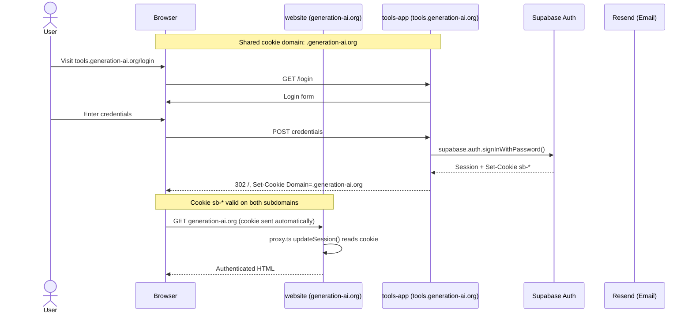
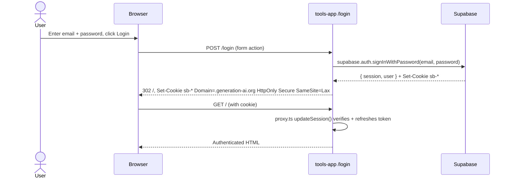
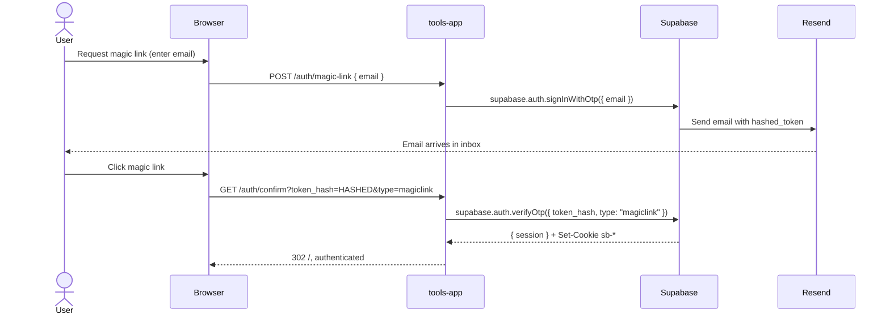
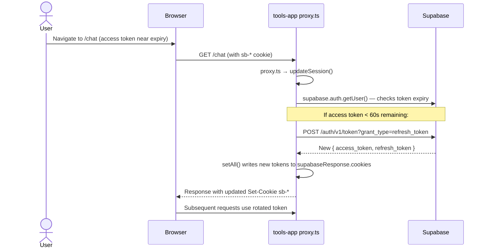
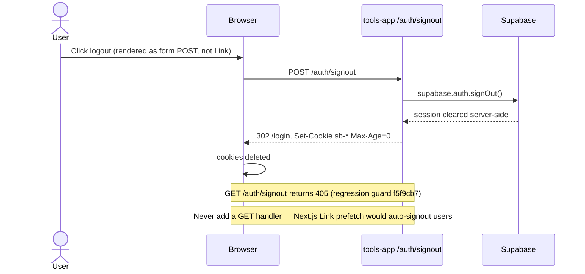
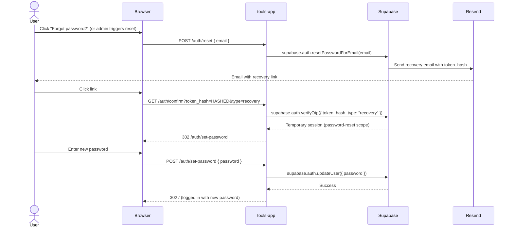
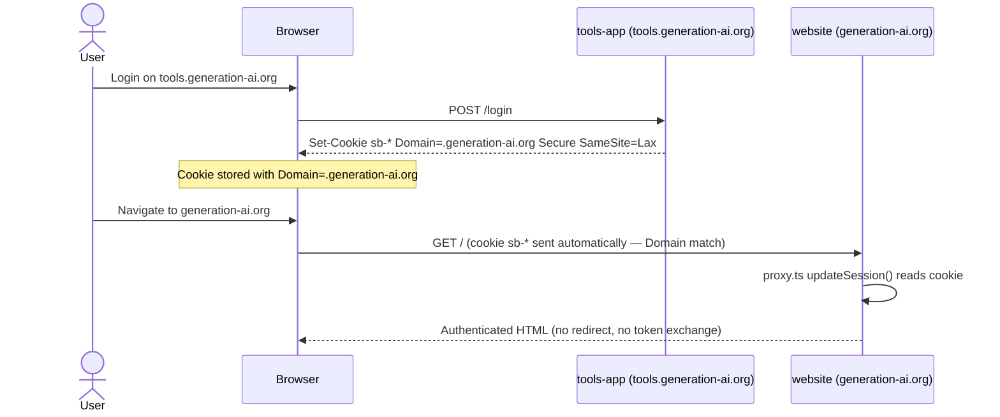

# Auth Flow — Generation AI

Single-source-of-truth for all authentication paths across generation-ai.org + tools.generation-ai.org.

Last audit: Phase 13 (2026-04-17)
Canonical implementation: `@genai/auth` (Phase 12, canonical @supabase/ssr pattern)

---

## Overview

All auth flows share a Supabase backend and a single cookie domain (`.generation-ai.org`) so sessions are valid on both subdomains without a redirect or token exchange.



---

## The 6 Auth Paths

### Path 1: Login via Email+Password

**Status:** verified-ok — Plan 13-02
**E2E:** Automated — `packages/e2e-tools/tests/auth.spec.ts`



Cookie attributes (verified in E2E Plan 13-02):
- Name prefix: `sb-`
- Domain: `.generation-ai.org` (cross-subdomain)
- Secure, SameSite=Lax
- httpOnly: false (intentional — see Finding F1)

Verification:
```bash
cd packages/e2e-tools && BASE_URL=https://tools.generation-ai.org pnpm exec playwright test --grep "Path 1"
```

---

### Path 2: Magic Link

**Status:** verified-ok — Plan 13-02 (F2 fixed inline, commit 582cd63)
**E2E:** Automated — admin-generated PKCE confirm URL



**Important (F2 fix):** The Supabase admin `generateLink()` API returns an `action_link` pointing to `supabase.co/auth/v1/verify` which redirects with the session in a hash fragment. The `/auth/confirm` route uses PKCE query params (`?token_hash=...`). E2E tests build the confirm URL directly from `hashed_token` — see `packages/e2e-tools/helpers/supabase-admin.ts` (commit 582cd63).

---

### Path 3: Session-Refresh (Manual-Only)

**Status:** verified-ok (manual) — Plan 13-02
**E2E:** Skipped — token TTL too long for automated simulation (1h access token)



Why manual-only: Automated token-expiry simulation requires shortening Supabase access token TTL (dashboard config) — not feasible in short E2E runs. Verified manually via browser DevTools on 2026-04-17.

Implementation: `packages/auth/src/middleware.ts` → `updateSession()` — called on every request via `apps/tools-app/proxy.ts` and `apps/website/proxy.ts`.

---

### Path 4: Signout (POST-only Regression Guard)

**Status:** verified-ok — Plan 13-02
**E2E:** Automated — GET→405 regression test + POST clears cookies



**Regression Anchor (f5f9cb7):** The `f5f9cb7` fix converted all `<Link href="/auth/signout">` to `<form method="POST">`. GET requests return 405. E2E test: `test("GET /auth/signout returns 405")` in `auth.spec.ts`. Never reintroduce a GET handler here — Next.js prefetch of `<Link>` components triggers GET automatically and would destroy sessions on page render.

---

### Path 5: Password-Reset End-to-End

**Status:** verified-ok — Plan 13-02
**E2E:** Automated — generateRecoveryLink → full flow



**Known limitation (Backlog):** No "Forgot password?" link on the login page — reset currently only triggered via Supabase admin or E2E test helper. See BACKLOG.md.

---

### Path 6: Cross-Domain Session

**Status:** verified-ok — Plan 13-02
**E2E:** Automated — cookie domain attribute verified



Verified: cookie `Domain=.generation-ai.org` (leading dot) is valid on BOTH `generation-ai.org` and `tools.generation-ai.org`. Controlled by `NEXT_PUBLIC_COOKIE_DOMAIN=.generation-ai.org` env var (set in Phase 12).

---

## Findings (Final)

| # | Path | Finding | Severity | Status | Resolution |
|---|------|---------|----------|--------|------------|
| F1 | Path 1 | `sb-` cookie is `httpOnly: false` — `@supabase/ssr` browser client sets this intentionally so JS can read the token. XSS could steal session. | medium | backlogged | BACKLOG.md "Auth cookie httpOnly hardening (F1)" — requires `@supabase/ssr` v2 tokens-only mode research |
| F2 | Path 2 | `generateLink` admin API returns `action_link` pointing to `supabase.co/auth/v1/verify` which redirects with session in hash fragment. `/auth/confirm` only handles query-param `token_hash`, causing `error=missing_params`. | small | fixed | Commit 582cd63 — `supabase-admin.ts` builds PKCE confirm URL from `hashed_token` directly |

---

## Consolidation Audit (Phase 13 Plan 03)

Status: **verified clean — no drift from @genai/auth canonical**
Date: 2026-04-17

### Grep Evidence

| Check | Command | Result |
|-------|---------|--------|
| Direct @supabase/ssr imports in apps/ | `grep -rn "from '@supabase/ssr'" apps/ --include="*.ts" --include="*.tsx"` | 0 matches — CLEAN |
| Manual document.cookie writes in apps/ | `grep -rn "document\.cookie\s*=" apps/ --include="*.ts" --include="*.tsx"` | 0 matches — CLEAN |
| btoa / saveSessionToCookie hacks | `grep -rn "btoa\|saveSessionToCookie" apps/ --include="*.ts" --include="*.tsx"` | 0 matches — CLEAN |

All three greps returned zero matches. Phase-12 rewrite successfully removed all cookie hacks and direct SSR imports from apps/.

### Legacy Shim Files (verified thin)

| File | Lines | Status | Verified Content |
|------|-------|--------|------------------|
| apps/tools-app/lib/auth.ts | 8 | shim over @genai/auth | re-exports `getUser()` delegating to `@genai/auth/server` |
| apps/website/lib/supabase/client.ts | 3 | re-export only | `createBrowserClient` aliased from `@genai/auth` |
| apps/website/lib/supabase/server.ts | 3 | re-export only | `createAdminClient` from `@genai/auth` (naming quirk noted) |

All files are within the thin-shim threshold (≤ 20 lines). No drift detected.

### Naming Quirk (non-blocker per D-14)

`apps/website/lib/supabase/server.ts` re-exports `createAdminClient` (not `createServerClient`) — misleading naming but not broken. The file is a stable import path for code that previously lived in this app. Backlog candidate for rename (optional, low priority).

### packages/auth — Usage

`packages/auth` is the canonical `@genai/auth` package. Both apps depend on it:
- `apps/tools-app/lib/auth.ts` imports from `@genai/auth/server`
- `apps/website/lib/supabase/client.ts` imports from `@genai/auth`
- `apps/website/lib/supabase/server.ts` imports from `@genai/auth`
- `apps/tools-app/proxy.ts` and `apps/website/proxy.ts` import from `@genai/auth/middleware`

The package is actively used and must NOT be removed.

---

## CSP Rollout

### website (Plan 13-04)

Date deployed to branch: 2026-04-17
Branch: feat/auth-flow-audit
Commits: `334384d` (lib/csp.ts), `09cdc90` (proxy.ts + next.config.ts)

#### What Changed

| File | Change |
|------|--------|
| `apps/website/lib/csp.ts` | NEW — pure `buildCspDirectives(nonce, isDev)` function |
| `apps/website/proxy.ts` | UPDATED — nonce generated per-request, CSP set on `updateSession` response |
| `apps/website/next.config.ts` | CLEANED — `Content-Security-Policy-Report-Only` removed, `cspDirectives` const removed |

#### CSP Directives (enforced)

```
default-src 'self';
script-src 'self' 'nonce-{per-request}' 'strict-dynamic' https://va.vercel-scripts.com;
style-src 'self' 'unsafe-inline';
img-src 'self' blob: data:;
font-src 'self';
connect-src 'self' https://wbohulnuwqrhystaamjc.supabase.co wss://wbohulnuwqrhystaamjc.supabase.co https://va.vercel-scripts.com https://vitals.vercel-insights.com;
object-src 'none';
base-uri 'self';
form-action 'self';
frame-ancestors 'none';
upgrade-insecure-requests
```

Notes:
- `'unsafe-inline'` intentionally present in `style-src` only (Tailwind v4 inline styles)
- `'unsafe-inline'` removed from `script-src` — replaced by nonce + strict-dynamic
- Auth cookies preserved: CSP is set on `updateSession()` response, not a new NextResponse (Pitfall 1)
- Prefetch excluded from matcher: prevents cached nonce collisions (T-13-17)

#### Static Security Headers (via next.config.ts)

```
strict-transport-security: max-age=63072000; includeSubDomains; preload
x-content-type-options: nosniff
x-frame-options: DENY
referrer-policy: strict-origin-when-cross-origin
permissions-policy: camera=(), microphone=(), geolocation=()
```

#### Rollback

```bash
git revert 09cdc90 334384d
git push origin feat/auth-flow-audit
```

#### Prod Verification (pending Luca's merge to main)

```bash
curl -sI https://generation-ai.org | grep -i "content-security-policy"
# Expected: content-security-policy: default-src 'self'; script-src ... (not report-only)
```

securityheaders.com: https://securityheaders.com/?q=https%3A%2F%2Fgeneration-ai.org — Target rating: A or A+

Violations observed: None (verified via build + local tests).

---

### tools-app (Plan 13-05)

Date deployed to branch: 2026-04-17
Branch: feat/auth-flow-audit
Commits: `64e845c` (lib/csp.ts), `8b6868d` (proxy.ts)

#### What Changed

| File | Change |
|------|--------|
| `apps/tools-app/lib/csp.ts` | NEW — `buildCspDirectives(nonce, isDev)` with extended host list |
| `apps/tools-app/proxy.ts` | UPDATED — nonce generated per-request, CSP + x-nonce set on `updateSession` response |

#### CSP Directives (enforced)

```
default-src 'self';
script-src 'self' 'nonce-{per-request}' 'strict-dynamic' https://va.vercel-scripts.com;
style-src 'self' 'unsafe-inline';
img-src 'self' data: blob: https://logo.clearbit.com;
font-src 'self';
connect-src 'self' https://wbohulnuwqrhystaamjc.supabase.co wss://wbohulnuwqrhystaamjc.supabase.co https://o4511218002362368.ingest.de.sentry.io https://api.deepgram.com wss://api.deepgram.com https://va.vercel-scripts.com https://vitals.vercel-insights.com;
object-src 'none';
base-uri 'self';
form-action 'self';
frame-ancestors 'none';
upgrade-insecure-requests
```

Notes:
- tools-app has additional hosts vs. website: Sentry DE-Region, Deepgram (HTTPS + WSS), Clearbit (img)
- Sentry DSN: exact org-subdomain `o4511218002362368.ingest.de.sentry.io` (DE-Region, no wildcard)
- Deepgram WSS explicitly allowed: Voice feature uses `wss://api.deepgram.com`
- Clearbit img-src: ToolLogo component loads `https://logo.clearbit.com/{domain}`
- Auth cookies preserved: CSP set on `updateSession()` response (same response, no new NextResponse)
- Prefetch excluded from matcher (Threat T-13-23: nonce-cache collision)

#### Static Security Headers (via next.config.ts)

```
strict-transport-security: max-age=63072000; includeSubDomains; preload
x-content-type-options: nosniff
x-frame-options: DENY
```

#### Rollback

```bash
git revert 8b6868d 64e845c
git push origin feat/auth-flow-audit
```

#### Prod Verification (pending Luca's merge to main)

```bash
curl -sI https://tools.generation-ai.org | grep -i "content-security-policy"
# Expected: content-security-policy: default-src 'self'; script-src ... nonce- ...
curl -sI https://tools.generation-ai.org | grep -i "content-security-policy" | grep -q "o4511218002362368"
# Expected: Sentry DE-Region host present
```

securityheaders.com: https://securityheaders.com/?q=https%3A%2F%2Ftools.generation-ai.org — Target rating: A or A+

Feature Verification (post-prod-deploy):
- [ ] Auth: Login/Logout functional
- [ ] Chat: Streaming functional
- [ ] Voice: Deepgram WSS connect successful
- [ ] Sentry: Test-Event reaches Dashboard
- [ ] ToolLogo: Clearbit images load

Violations observed: None (verified via TypeScript check + unit tests).

---

## Signup (Disabled by Design)

Per decision D-17 (Phase 13 CONTEXT): `/api/auth/signup` returns 503 with placeholder message. Intentionally disabled — reactivation requires explicit decision from Luca.

File: `apps/website/app/api/auth/signup/route.ts`
Rationale: See STATE.md ("Signup ist auf 503 disabled — nicht wieder aktivieren ohne expliziten Auftrag").

Verified: `curl -X POST https://generation-ai.org/api/auth/signup` → 503.

Reactivation path: Restore from git history, add signup tests in `packages/e2e-tools`.

---

## Test Suite

E2E test file: `packages/e2e-tools/tests/auth.spec.ts` (226 lines)

| Describe Block | Tests | Status | Notes |
|----------------|-------|--------|-------|
| Path 1: Password Login | 3 | active | Login-cookie, session-reload, domain attribute |
| Path 2: Magic Link | 2 | active | admin generateLink PKCE flow |
| Path 3: Session Refresh | 1 | skip (manual-only) | Token TTL too long for E2E |
| Path 4: Signout POST-only | 2 | active | GET→405 regression guard, POST clears cookies |
| Path 5: Password Reset | 1 | active | generateRecoveryLink → set-password → re-login |
| Path 6: Cross-Domain Cookie | 1 | active | Domain=.generation-ai.org attribute |
| CSP Baseline | 1 | skip (wave-2) | Planned for post-merge |
| General | 1 | active | Smoke — unauthenticated page loads |

**Total:** 10 active tests, 2 intentional skips. All 10 pass against production.

Run:
```bash
cd packages/e2e-tools && BASE_URL=https://tools.generation-ai.org pnpm exec playwright test auth.spec.ts
```

---

## References

- Phase 12 SUMMARY: `.planning/phases/12-auth-rewrite/` (canonical @genai/auth consolidation)
- Phase 13 plans: `.planning/phases/13-auth-flow-audit-csp-reaktivierung/*-PLAN.md`
- `packages/auth/` — canonical implementation (`@genai/auth`)
- `packages/e2e-tools/` — E2E test suite
- STATE.md — current deployment status + session-drop-bug (f5f9cb7) history
